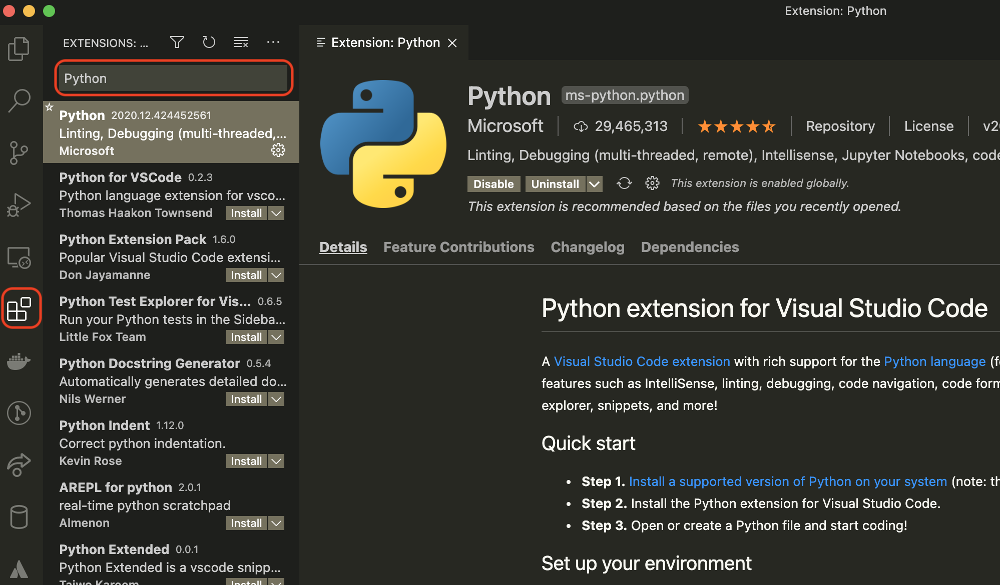

# インストール

Python 開発に必要な下記のツールをインストールします。

- Python
- Visual Studio Code

## Python

各プラットフォームに合わせて Python のインストール手順が下記サイトにまとまっていますのでインストールをしてください。

- [macOS](https://www.python.jp/install/macos/install_python.html)
- [Windows](https://www.python.jp/install/windows/install.html)

コマンドを打って Python が正しくインストールされたかどうかを確認します。

=== "macOS"

    ターミナル上で下記コマンドを実行します。

    ```shell
    $ python3 --version
    ```

    バージョンが表示されれば成功です。

=== "Windows"

    コマンドプロンプト上で下記コマンドを実行します。

    ```shell
    $ py -3 --version
    ```

    バージョンが表示されれば成功です。

## Visual Studio Code のインストール

Visual Studio Code (VS Code) はエンジニアの間で人気のエディタです。
拡張機能を取り入れることで見た目の変更や機能追加などを自由にカスタマイズできるのが特徴です。

下記のサイトで VS Code をダウンロードし、インストールをしてください。

!!! Info "VS Code"
    [https://code.visualstudio.com/](https://code.visualstudio.com/)

次に Python の開発環境を整えるための VS Code 拡張機能をインストールします。

| 拡張機能                                  | 概要                        |
|-------------------------------------------|-----------------------------|
| [Python extension for Visual Studio Code] | Python 開発のための基本機能 |
| [Pylance]                                 | コード補完                  |
| [Visual Studio IntelliCode]               | オートコンプリート          |

[Python extension for Visual Studio Code]: https://marketplace.visualstudio.com/items?itemName=ms-python.python
[Pylance]: https://marketplace.visualstudio.com/items?itemName=ms-python.vscode-pylance
[Visual Studio IntelliCode]: https://marketplace.visualstudio.com/items?itemName=VisualStudioExptTeam.vscodeintellicode

インストールは VS Code を起動した後、左側にあるペインから拡張機能のタブを選択し、
インストールする拡張機能を検索してインストールします。

[](img/vscode-01.png)
