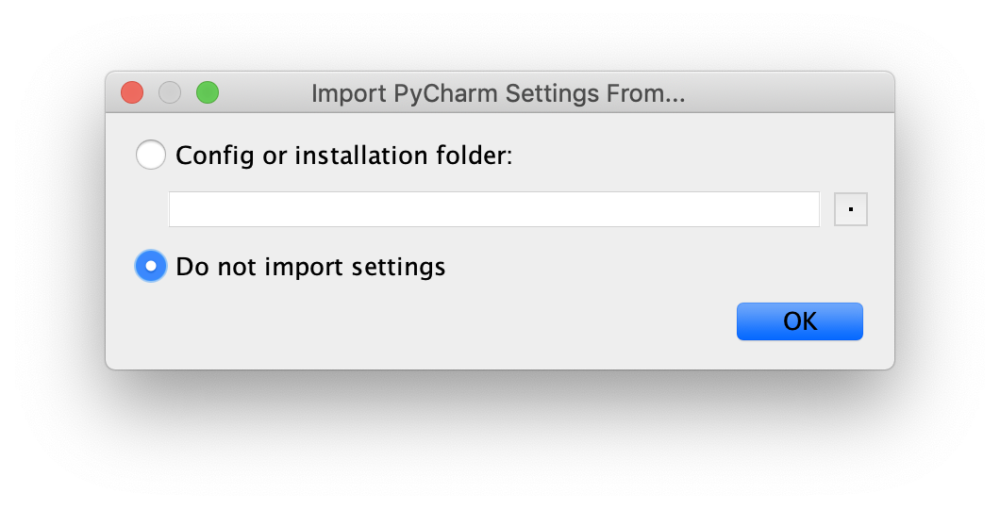
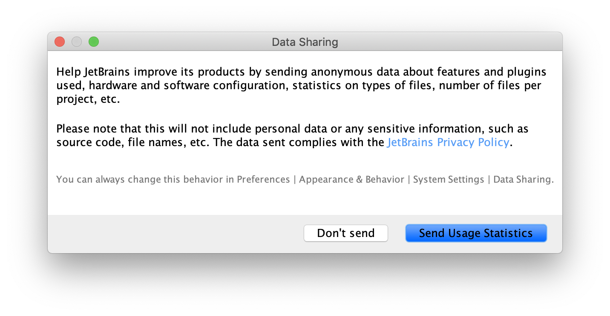
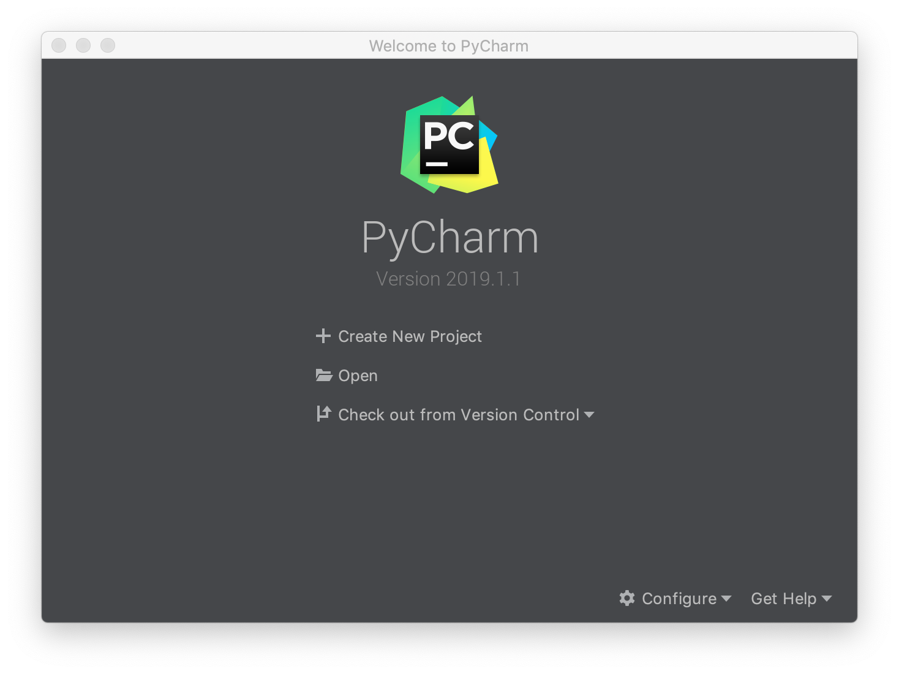
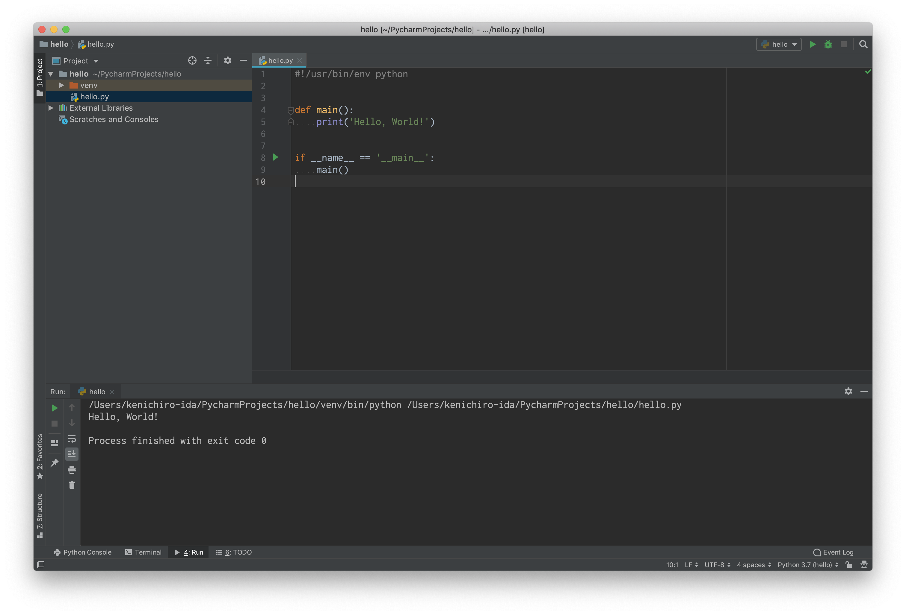

# Hello, World!

標準出力に `Hello, World!` と表示するプログラムを書いてみます。まずは PyCharm の設定を行います。

## PyCharm の起動


そのまま `OK` を押します。

---


プライバシーポリシーに同意して `Continue` を押します。

---


匿名データを送信してもいいかどうかを選択します。これはどちらを選択しても構いません。

---


キーマップを選択します。PyCharm 未経験者であれば左を、経験者であれば右を選択します。

---


UI のテーマを選択します。お好みの方を選択してください。

---


コマンドラインから使用できる起動スクリプトを作成するかどうかを選択します。作成する場合はチェックボックスにチェックを入れてください。

---


プラグインを追加します。ここは何もせず `Start using PyCharm` を押してください。

---


`Create New Project` を選択します。

---


`New environment using` というラジオボタンを選択します。`Base interpreter` のところにはターミナル上で下記のコマンドの出力結果を貼り付けてください。Windows の場合はここはデフォルトのままで大丈夫です。

```shell
$ which python
```

macOS の場合は `/Users/kenichiro-ida/.pyenv/shims/python` のような結果になるはずです。

---


これで PyCharm が起動し、新規プロジェクトが作成できました。

---

## プログラムを作成する

PyCharm の左にあるプロジェクトツリーを右クリックし `New` > `Python file` を選択します。


`Name` のところに `hello` と入力して `OK` を押します。`hello.py` というファイルが作成されるので下記のようにプログラムを作成してください。

**hello.py**

```python
#!/usr/bin/env python


def main():
    print('Hello, World!')


if __name__ == '__main__':
    main()
```

ここまでできたらファイルを保存してプログラムを実行してみます。


8 行目にある再生ボタンをクリックし `Run 'hello'` を選択すると下部に `Hello, World!` というメッセージが表示されます。

## 構文の説明

### シバン

```python hl_lines="1"
#!/usr/bin/env python


def main():
    print('Hello, World!')


if __name__ == '__main__':
    main()
```

`#` から始まる 1 行目は [シバン] といいます。シバンはこのソースコードを実行する際に使用するコマンドを記述します。`/usr/bin/env python` は `python` コマンドを呼び出しているという意味になります。

[シバン]: https://ja.wikipedia.org/wiki/%E3%82%B7%E3%83%90%E3%83%B3_(Unix)

!!! warning
    Windows では `python` コマンドの代わりに `py` コマンドを使用するように説明しましたが、シバンは

    ```
    #!/usr/bin/env python
    ```

    と書いて下さい。

### `main()`

```python hl_lines="4 5"
#!/usr/bin/env python


def main():
    print('Hello, World!')


if __name__ == '__main__':
    main()
```

これは関数の定義をしています。関数の詳細な説明は [関数] の章で説明します。

`print()` がインデントされていることはとても重要です。なぜなら

```python
def main():
print('Hello, World!')
```

と書くと構文エラーになるからです。関数の実装は必ずインデントしてから記述するルールになっています。

### `__name__`

```python hl_lines="8 9"
#!/usr/bin/env python


def main():
    print('Hello, World!')


if __name__ == '__main__':
    main()
```

`main()` は関数を呼び出しています。`if __name__ == '__main__':` については [モジュール] の章で説明しますので、今はおまじないだと思って下さい。`main()` の呼び出しは必ずインデントをして下さい。さもないと構文エラーになります。

### シンプルな書き方

Python の処理はソースコードの上の行から逐次実行されます。そのため、処理を関数内に収めなくても正しく実行することができます。

```python
#!/usr/bin/env python


print('Hello, World!')
```

しかし特別な理由がある場合を除いて、関数内に定義する方が望ましいです。その理由は [モジュール] の章で明らかになります。

[関数]: ch02-02-functions.md
[モジュール]: ch04-01-modules.md
