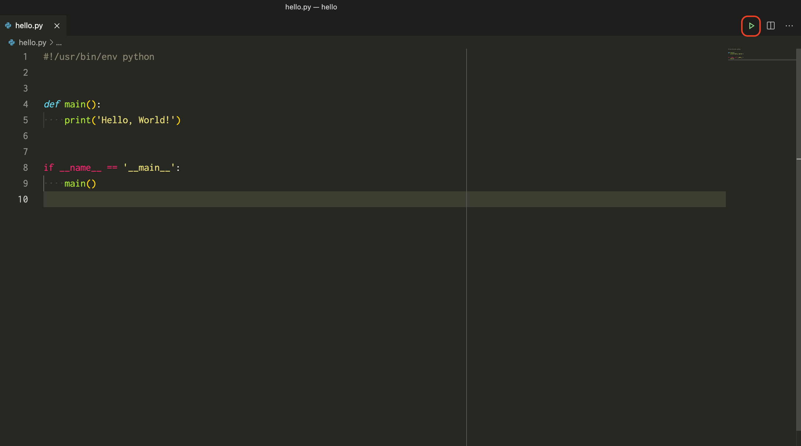

# Hello, World!

標準出力に `Hello, World!` と出力する簡単な Python プログラムを書いてみます。

---

まずターミナル上で `hello` というディレクトリを作成し、それを VSCode で開きます。

```shell
$ mkdir hello
$ cd hello
$ code .
```

[](img/vscode-02.png)

---

次にファイルの新規作成のアイコンを押して `hello.py` という名前のファイルを作成します。

[](img/vscode-03.png)

---

ファイルを作成してそのファイルを開くとウィンドウの左下に使用する Python のバージョンが表示されます。
このバージョンがインストールした Python のバージョンと異なる場合は Python のバージョンをクリックすると
使用する Python を変更することができます。

[](img/vscode-04.png)

複数の Python をインストールしている場合にはこのようにして使用する Python を変更してください。

---

ここまでできたら `hello.py` にコードを書いてみます。

**hello.py**

```python
#!/usr/bin/env python


def main():
    print('Hello, World!')


if __name__ == '__main__':
    main()
```

できたらファイルを保存してプログラムを実行してみます。

ウィンドウの右上にある再生ボタンをクリックするとプログラムが実行されます。

[](img/vscode-05.png)

## 構文の説明

### シバン

```python hl_lines="1"
#!/usr/bin/env python


def main():
    print('Hello, World!')


if __name__ == '__main__':
    main()
```

`#` から始まる 1 行目は [シバン] といいます。シバンはこのソースコードを実行する際に使用するコマンドを記述します。`/usr/bin/env python` は `python` コマンドを呼び出しているという意味になります。

[シバン]: https://ja.wikipedia.org/wiki/%E3%82%B7%E3%83%90%E3%83%B3_(Unix)

!!! warning
    Windows では `python` コマンドの代わりに `py` コマンドを使用するように説明しましたが、シバンは

    ```
    #!/usr/bin/env python
    ```

    と書いて下さい。

### `main()`

```python hl_lines="4 5"
#!/usr/bin/env python


def main():
    print('Hello, World!')


if __name__ == '__main__':
    main()
```

これは関数の定義をしています。関数の詳細な説明は [関数] の章で説明します。

`print()` がインデントされていることはとても重要です。なぜなら

```python
def main():
print('Hello, World!')
```

と書くと構文エラーになるからです。関数の実装は必ずインデントしてから記述するルールになっています。

### `__name__`

```python hl_lines="8 9"
#!/usr/bin/env python


def main():
    print('Hello, World!')


if __name__ == '__main__':
    main()
```

`main()` は関数を呼び出しています。`if __name__ == '__main__':` については [モジュール] の章で説明しますので、今はおまじないだと思って下さい。`main()` の呼び出しは必ずインデントをして下さい。さもないと構文エラーになります。

### シンプルな書き方

Python の処理はソースコードの上の行から逐次実行されます。そのため、処理を関数内に収めなくても正しく実行することができます。

```python
#!/usr/bin/env python


print('Hello, World!')
```

しかし特別な理由がある場合を除いて、関数内に定義する方が望ましいです。その理由は [モジュール] の章で明らかになります。

[関数]: ch02-02-functions.md
[モジュール]: ch04-01-modules.md
